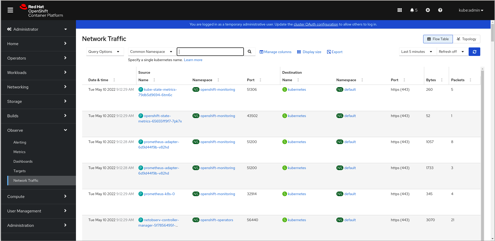
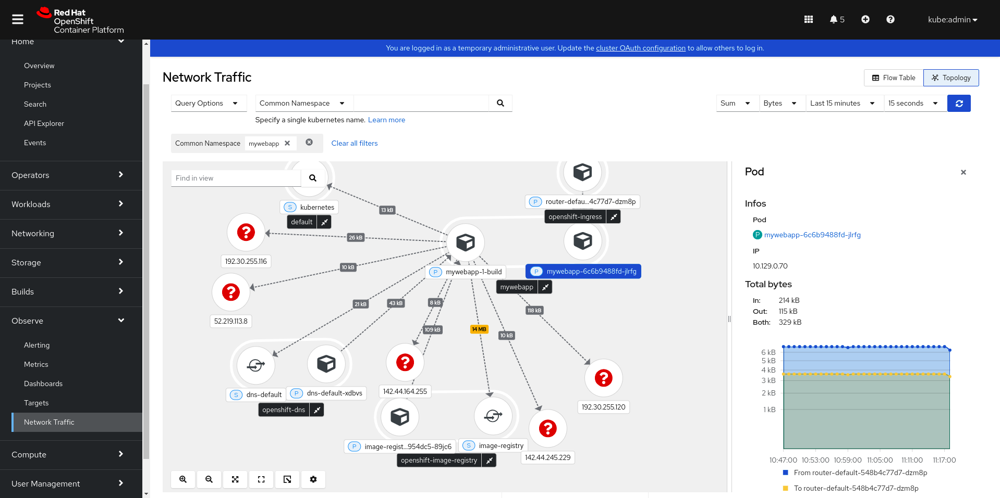
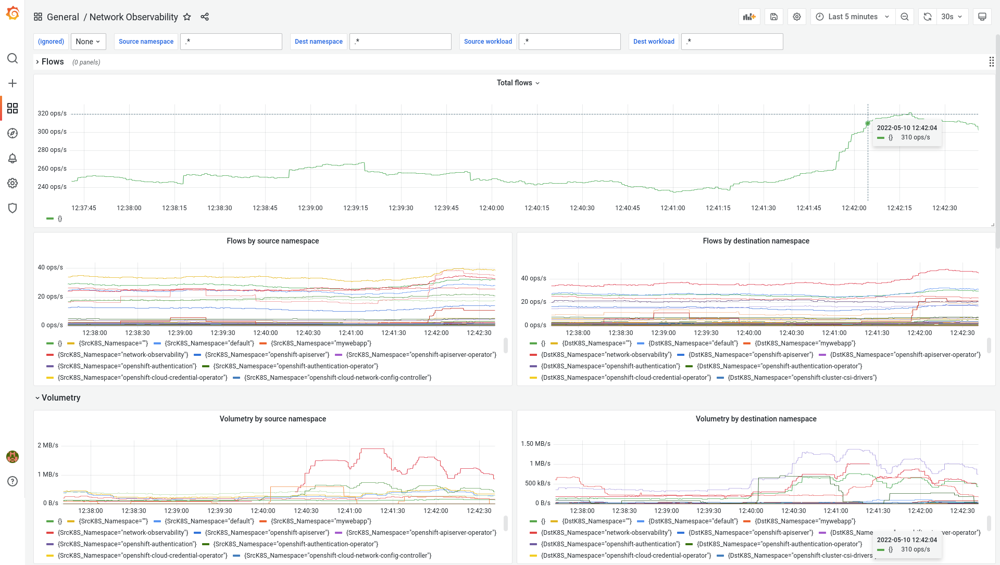

# A Guide to Providing Insight with Network Observability

By: Steven Lee

Red Hat OpenShift Container Platform (OCP) has had monitoring capabilities from
the start.  You can view monitoring dashboards, and manage metrics and alerts.
With the OCP 4.10 release, Network Observability is introduced in Developer
Preview mode.

Developer Previews provide early access to something that we at Red Hat are
working on, but is not ready for prime time. The Network Observability feature
provides the ability to export, collect, enrich, and store NetFlow data as a
new telemetry data source.  There is also a frontend that integrates with
OpenShift web console to visualize these flows and sort, filter, and export
this information.

NetFlows is a technology developed by Cisco in 1996 where networking devices
such as a switch, router, or firewall track packets coming in and out of
interfaces.  The latest version, called IP Flow Information Export (IPFIX), is
supported by all major vendors.  By collecting and storing this data, it opens
up a wide range of possibilities that can aid in troubleshooting networking
issues, determining bandwidth usage, planning capacity, validating policies,
and identifying anomalies and security issues.  This data provides insights
into:

* How much traffic is flowing between any two pods?
* What percentage of the overall traffic is web traffic?
* What are the peak times when there is the highest amount of traffic?
* How many bytes per second are coming in and out of a pod?
* How much traffic was handled by a particular Kubernetes service?
* Is any traffic using insecure protocols, such as http, ftp, and telnet?


## How do you start?

Now that I’ve piqued your interest, what do you need to start?  While it’s
possible to run this on any Kubernetes cluster that is configured to export
IPFIX, I will only focus on the scenario where you are running OpenShift 4.10.

The prerequisites are:

1. OpenShift cluster<br>
    The cluster can be self-managed or any of the supported [Red Hat Cloud
Services](https://www.redhat.com/en/technologies/cloud-computing/openshift/cloud-services).
If you are creating a cluster, be sure to set the Container Networking
Interface (CNI) provider to be OVN-Kubernetes (see next item).  Red Hat offers
a [free trial](https://www.redhat.com/en/technologies/cloud-computing/openshift/try-it)
if you don’t have a cluster.

2. Using OVN-Kubernetes as the CNI provider<br>
    The CNI provider must be OVN-Kubernetes because it leverages the Open
vSwitch (OVS) to provide flows.  If your CNI is OpenShift SDN, there is a
[migration guide](https://docs.openshift.com/container-platform/4.10/networking/ovn_kubernetes_network_provider/migrate-from-openshift-sdn.html)
to help you switch over, but make sure you understand the implications of this
change.

3. Access to an account on your cluster that has the cluster-admin role,
such as kubeadmin.


## Installation

The installation procedure creates a persistent volume to store NetFlow data.
It installs [Grafana Loki](https://grafana.com/oss/loki/), which facilitates
the saving and indexing of data.  The installation process deploys a flow
collector to collect NetFlows and a user interface plugin for visualization.
Note the term NetFlow is used generically in this blog, but it refers
specifically to IPFIX in Network Observability.

What is shown here will only require OpenShift web console, a web-based
application, so there is no need to install any software on your computer to
try this out.  If you have Red Hat’s **oc** client installed, you can follow
the steps in the NetObserv Operator to do this on the command line instead.

This creates various Kubernetes objects to provide a better understanding of
OpenShift.  IMPORTANT: These steps are for this Developer's Preview only, and
may be different for future versions.

1. Log into the OpenShift web console as kubeadmin or with an account with
cluster-admin role.

2. Create a new project
    1. From the Navigation Panel, click **Home > Projects**.
    2. Click the **Create Project** button.
    3. Enter `network-observability` for the **Name** and click **Create**.

3. Create persistent volume
    1. From the Navigation Panel, click **Storage > PersistentVolumeClaims**.
    2. Click the **Create PersistentVolumeClaim** button.
    3. Enter `loki-store` for the **PersistentVolumeClaim name**.  Change
       **Size** to 1 or more GiB, and then click **Create**.

4. Install Loki
    1. From the Navigation Panel, click **Workloads > Pods**.
    2. Click the **Create Pod** button.
    3. Replace the text with the following:

        ```
        apiVersion: v1
        kind: Pod
        metadata:
          name: loki
          labels:
            app: loki
        spec:
          volumes:
            - name: loki-store
              persistentVolumeClaim:
                claimName: loki-store
          containers:
            - name: loki
              image: grafana/loki
              volumeMounts:
                - mountPath: "/loki-store"
                  name: loki-store
        ```

    4. Click **Create**.  Watch the pod go from `Pending` to
       `ContainerCreating` to `Running`.
    5. From the Navigation Panel, click **Networking > Services**.
    6. Click the **Create Service** button.
    7. In the YAML file, replace **name** and **app** with `loki`.  Change
       **port** to `3100` and remove **targetPort**.  It should look like the
       following:

        ```
        apiVersion: v1
        kind: Service
        metadata:
          name: loki
          namespace: network-observability
        spec:
          selector:
            app: loki
          ports:
            - protocol: TCP
              port: 3100
        ```


    8. Click **Create**.

5. Install Network Observability
    1. From the Navigation Panel, click **Operators > OperatorHub**.
    2. In the filter field, enter `netobserv`.  Select **NetObserv Operator**.
        This is a community operator so you will get a warning that this may not
        be stable and that there is no support so it goes without saying that this
        should not be deployed in production.
    3. Click **Install** to move to the next page.  Accept all the defaults and
       click **Install** again.  It will take a few seconds to install the
        flow collector and the user interface plugin.
    4. From the Navigation Panel, click **Operators > Installed Operators**.
        On the **NetObserv Operator** row, click the **Flow Collector** link, and then
        **Create FlowCollector**.
    5. Click **>** in the **Ipfix** section to open this up.  Change Sampling to
       `1`.  Then click **Create**.
    7. After some time which could be up to a minute, a dialog with the title
        **Web console update is available** should appear.  Click the **Refresh
        web console** link.
    7. Reload the web page and verify that **Observe > Network Traffic** exists.
        If not, double check your work and see if there are any reported errors.
    8. Click **Observe > Network Traffic**, and you should see a NetFlow table
        with lots of data!  If the table is empty, wait a few seconds and try again.


## To sample or not to sample

Flow sampling means instead of tracking every packet going through your
network, it processes a small sample.  This is similar to sampling used in a
poll to predict who will win an election.

By default, FlowCollector sets sampling to 400 or a 1:400 ratio.  This means
only one packet is observed for every 400 packets.  While this might seem like
a low ratio, it is typically even lower for high bandwidth connections.

If you just want to get an overall view of your network traffic, sampling is an
acceptable solution.  In fact, all the questions that were asked at the
beginning of this blog can be answered with sampling turned on.  However, if
you are looking for specific data for troubleshooting or need this for auditing
purposes, then you will likely turn this off at the expense of more CPU,
memory, storage, and bandwidth.  For our purposes, we configured sampling to be
1 earlier which means no sampling.


## Ready to observe

In **Observe > Network Traffic**, even without any developer projects, there is
internal traffic generated by the master nodes and worker nodes of Kubernetes.
This is a good starting point.  Figure 1 shows what the NetFlow table looks
like.


_Figure 1: NetFlow table_

The NetFlow table provides an almost real-time view of data flowing through the
cluster.  NetFlow data sent by OVS is enriched to include Kubernetes-related
information, such as namespace and name, which includes pods and services.  Scroll
to see more flows or click the **Refresh** button.  Get a better sense of some of
the more common services such as apiserver, router, etcd, and dns interacting
with other pods.  You can have the table automatically refresh periodically.
As you observe the traffic, you might be surprised by what you see.

With filtering, you can observe traffic going into or out of a single pod or
observe traffic between any two pods.  With the former, if you want to see who
is accessing the apiserver, for example, in the filter drop-down, select
**Name** under the **Common** section, and enter `apiserver`.  If you want an
exact match, use quotation marks.  To ensure that it’s only HTTPS traffic,
in the filter drop-down, select **Destination** and then **Port**.  Enter `443`
or `https` in the filter field.  The filters are additive so if you want to
start over, be sure to click **Clear all filters**.

Understand that this is showing traffic flows so if you make an HTTP request
from one pod to a web server on another pod, there will be flows in both
directions because the request will be from client to server, but the response,
which is typically a larger amount of data, goes from server to client with the
ports flipped.  That means if you want to check that your server isn’t
initiating connections with other pods, ignore the traffic where the _source_
port is 443 or any ports that it is listening on.

The NetFlow table has many more options and features.  In the **Query Option**s
drop-down menu, you can display **Source** flows which are ingress flows going
into an interface, **Destination** flows which are egress flows going out of
the interface (default), or both.  In the same drop-down menu, there is an
option to match all or match any filter.  You can also select how many flows
to display in the UI.

Next to the filter field are three other options.  The first option manages what
columns to display as there are many more columns to display, such as Protocol,
IP and Direction.  There are also a few super-columns like "IPs and Port" that
display the source IP, source port, destination IP and destination port, all in
one column.

The next option is the display format, including a compact view to show one flow
per line.  The last option exports the data in CSV format, which is compatible
with any Excel-like spreadsheet.  You can sort on any column and click any row
to see more details about the flow.  Finally, there is a time range selection
to further limit and filter the data.


## Deploy an application

We will create a file and media web server project that will let you upload
files to a server, and depending on the file type, the browser will handle it
properly.  That is, if it’s a sound file, it will play the music.  If it’s a
video file, it will play the video.  If it’s an image file, it will display the
picture.  This will be accessible by anyone who knows the URL.  We will examine
the NetFlow table as we do these actions.

1. From the Navigation Panel, click **Administrator** and then select **Developer**
to switch to the Developer view.  Click **Skip Tour** to skip the tour.
2. Click the **Project** drop-down menu and click **Create Project**. Enter
`mywebapp` and then click **Create**.
3. In the **+Add** panel, click the **_Samples_** section.
4. Scroll down and select **PHP**.
5. In the **Name** field, enter `mywebapp` and then click **Create**.

This takes you to the **Topology** panel.  After about a minute, you should
have a running web server.

On the PHP icon, click the arrow link that says **Open URL** in the tooltip.
If the page says _Application is not available_, wait and then refresh the
page.  It will say _Welcome to your CakePHP_ when it is complete.

Go back to the **Topology** panel, click the PHP icon and then the pod name
link.  Click the **Terminal** tab.  Paste the following text into the shell.
This code creates a web page allowing you to upload files.

```
cat > webroot/upload.php << 'EOF'
<?php
if ($_SERVER['REQUEST_METHOD'] === 'POST') {
    $target_dir = "img/";
    $target_file = $target_dir . basename($_FILES["upload_file"]["name"]);
    $ext = pathinfo($target_file, PATHINFO_EXTENSION);

    if (move_uploaded_file($_FILES["upload_file"]["tmp_name"], $target_file)) {
        $msg = basename( $_FILES["upload_file"]["name"]) . ' was uploaded successfully.';
        $status = 'success';
    } else {
        $msg = 'There was an error uploading your file.';
        $status = 'error';
    }
    if (isset($_POST['text']) && $_POST['text']) {
        echo "$msg\n";
        return;
    }
}
?>
<!DOCTYPE html>
<html>
<head>
<meta charset="utf-8">
<title>Upload File</title>
</head>
<body>
<?php
if ($_SERVER['REQUEST_METHOD'] === 'POST') {
    echo "<p>$msg</p>";
}
?>
<form method="post" enctype="multipart/form-data">
<h3>Choose the file to upload and then click the Upload button.</h3>
<p><input type="file" name="upload_file" id="upload-file"></p>
<p><input type="submit" value="Upload" name="submit"></p>
</form>
</body>
</html>
EOF
```

Go back to the browser tab containing  the home page of your app.  Add
`/upload.php` to the address.  At the time of this writing, my URL, which is no
longer valid, was
`http://php-sample-mywebapp.apps.stlee-cluster104.devcluster.openshift.com/upload.php`.
Before you upload a file, set up the filters in the NetFlow table to view the
traffic on this server.

1. In the drop-down menu that says **Developer**, select **Administrator**.
2. From the Navigation Panel, click **Observe > Network Traffic**.
3. In the filter field for **Common Namespace**, enter `mywebapp` and press **Enter**.
4. In the **Refresh** drop-down menu, select _**15 seconds**_.
5. In the time range drop-down menu next to **Refresh**, select _**Last 15 minutes**_.

Now go back to the app page and upload a file to the server.  Upload a mp3
sound file or a mp4 video clip.  Depending on your network connection, it may
take some time to upload.  At this point, you should see some flows in the
table.  Click the **Date & time** column to sort on that column.  To play the
sound file or view a video, add `/img/<filename>` to the home page URL.  You
now have a public file and media server!

Continue to watch the NetFlow table as you are doing these actions.  Can you
see which way the flow of traffic is going?  The web server is running on port
8080 and the other port is an ephemeral port.  You can remove all the filters
and sort by **Bytes** to view the top talker flows.  Explore to see what other
information you can get from this data.


## Topology
To get a visual representation of the flows, click **Topology** in the
upper right corner to switch to a network graph view.  Click the `mywebapp`
pod to see the view as shown in Figure 2.


_Figure 2: Topology_

This gives an at-a-glance view of your cluster grouped by namespaces.  The
filters persist when switching to the topology view so it is only showing the
`mywebapp` namespace and other namespaces that it is interacting with.  At
the bottom of the page, it shows the number of flows and the amount of traffic
for this view.

You can drag any item to move it around.  If you drag the graph area, it
moves the entire graph.  The first four icons in the bottom left corner
lets you zoom and adjust the view.  The fifth icon exports the view and
saves the topology as an image file.

There are many options to reduce the data and narrow down to what you 
are looking for.  Click the settings icon (last icon in the bottom left
corner) to bring up the **Options** dialog box.  Here, you can choose the
different displays, how you want the items to be grouped, and a few
toggles on what to show in the topology.  Outside of this dialog box and to
the left of the time range (e.g. Last 15 minutes), you can choose what
to display on the graph edges and whether to display in bytes or
packets.


## Dashboard graphs

The NetFlow table and topology are great ways to see a snapshot of what’s
happening now, but the amount of data might be overwhelming unless you know
exactly what you’re looking for.  The data can be presented in a time series
using a line graph.  Figure 2 shows the graphs you can create with Grafana
based on the same NetFlow data by doing the following:

1. If in Administrator view, click **Administrator** and then select
**Developer** to switch to Developer view.
2. Click the **Project** drop-down menu and choose **network-observability**.
3. Click **+Add** and then click the **Container images** section.
4. Enter `grafana/grafana:8.5.1` for the image name and click **Create**.

This takes you to the **Topology** panel.  Click the arrow link in the **grafana**
icon to launch the web page for Grafana.  You may have to wait for the application
to start.  The page indicates that it’s not secure, but go ahead and continue.
Log in by entering `admin` for the username and password.  You are prompted to
change the password.  After that, we will set up and import the dashboard.

1. On the left menu, click the gear icon (second from the last in the top set of
icons), and select **Data sources**.
2. Click **Add data source**.
3. Click **Loki**.  For the **URL**, enter `http://loki:3100`.
4. Click the **Save & test** button, and make sure everything is okay.
5. Download the dashboard JSON file
[here](https://raw.githubusercontent.com/netobserv/network-observability-operator/0.1.2/config/samples/dashboards/Network%20Observability.json).
6. On the left menu, click the **+** icon and select **Import**.
7. Click the **Upload JSON file** button, and select the file you just downloaded.
You should see the graphs now.


_Figure 3: Grafana dashboard graphs_

While we are planning to add graphs in OpenShift web console, you can always
use Grafana to create whatever specific graphs you need.


## What’s next?

This is just the tip of the iceberg as the team is working hard to provide some
more nifty visualizations and innovation in the coming months.  Remember,
this is a Developer Preview feature so expect things to change.  If you want
“observability” into what we are doing, head over to our
[GitHub](https://github.com/netobserv).  This is an open community project that
will work outside of OpenShift so you can help shape the future!
